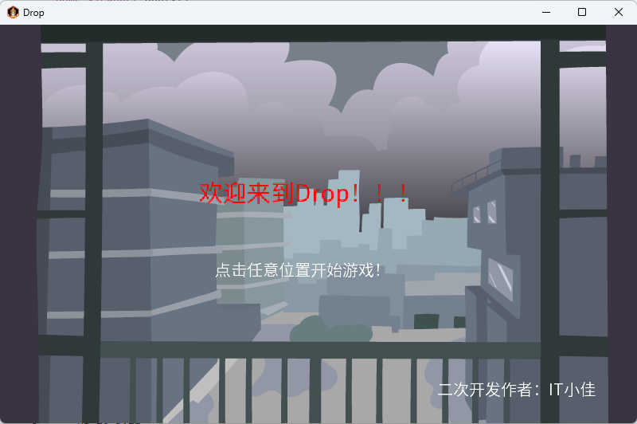
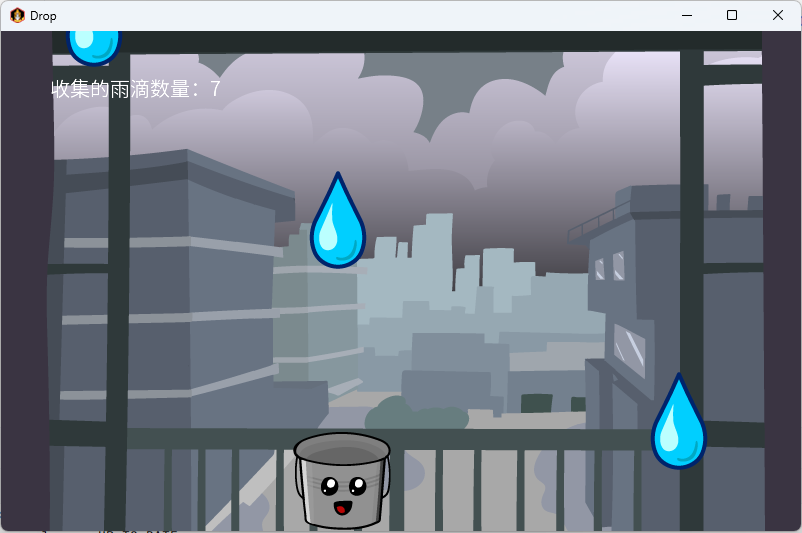

# Drop

一个使用 [libGDX](https://libgdx.com/) 生成的项目，通过 [gdx-liftoff](https://github.com/libgdx/gdx-liftoff) 创建。

该项目使用包含简单应用程序启动器和一个空的 `ApplicationListener` 实现的模板生成。

> 该项目由作者 [IT小佳](https://github.com/it-xiaojia) 基于libGDX示例项目二次开发

> 官方示例项目仓库地址：[tutorials](https://github.com/libgdx/libgdx.github.io/tree/dev/assets/downloads/tutorials)

> 官方Wiki：[Wiki链接](https://libgdx.com/wiki/)

## 平台

- `core`: 主模块，包含所有平台共享的应用程序逻辑。
- `lwjgl3`: 主要的桌面平台，使用 LWJGL3；在旧文档中称为 'desktop'。
- `android`: Android 移动平台。需要 Android SDK。

## 项目拓展

- 使用通义AI生成代码注释，更好理解官方示例demo
- 加入中文（包括大部分中文标点符号）支持：中文字库-思源黑体 Normal

## 游戏运行截图

